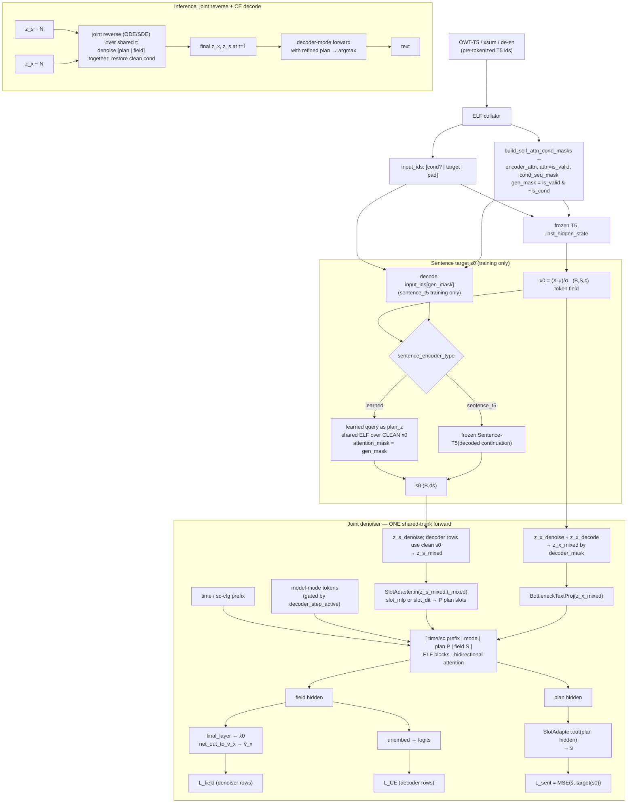

# Fusion Architecture — STAR-LDM plan-token × ELF global denoiser

This document describes the current ELF fusion scaffold: re-introducing
STAR-LDM's **sentence-level diffusion plan-token** on top of ELF's global
(bidirectional, per-token) denoising trunk, so that **one denoising forward
jointly denoises a sentence latent and the token-embedding field**, sharing one
trunk. In the current code, the plan bridge has two local adapter choices:
`slot_mlp` maps one sentence latent into plan slots and maps processed slots
back with MLP-style projections; `slot_dit` keeps the same interface but adds a
small time-conditioned bidirectional DiT over the plan slots before and after
the shared ELF trunk. The older STAR-LDM-specific adapter name/path is removed.

It is written in the style of STAR-LDM's `docs/architecture.md` (mermaid
topology + formulas), but it now tracks the implemented code path.

## Why

STAR-LDM's learned-encoder recipe failed because the sentence latent is
**produced globally** (a bidirectional score net denoises it) but **consumed
locally** (GPT-2 autoregressive, teacher-forced). The ground-truth prefix is a
bypass that lets the latent get away with per-token local disambiguation, so it
never learns to carry global content; and because cross-entropy was its only
training signal, the encoder collapsed to a near-constant (`emb_batch_var`
≈ 9.85e-7).

ELF is the existence proof of the fix — a *global denoising decoder*: it denoises
per-token **frozen-T5** embeddings bidirectionally and reads them back to tokens
with a decoupled CE head. The encoder is frozen, so it cannot collapse; there is
no AR prefix bypass.

This design keeps ELF's global-denoising mechanism but restores STAR-LDM's
identity — a sentence "plan" that steers generation:

- The plan latent is **diffused jointly** with the token field in the shared
  trunk.
- Because the plan must *help denoise the grounded frozen-T5 field*, it receives
  a dense, collapse-resistant global gradient — exactly the signal STAR-LDM
  lacked.

The headline scientific question (**ablation 1**): *under a global-denoising
decoder, can the sentence encoder finally be learned* (vs. a frozen
Sentence-T5 target)?

## UNITE Analogy

The learned-plan arm borrows the UNITE-style ratio idea, but it is not a
literal STAR-LDM/UNITE topology. ELF fuses the token denoiser and decoder in one
shared bidirectional trunk, so the token-field objectives are also legitimate
signals for learning whether `s0` is useful as an in-context plan.

For image latent diffusion, the pattern is:

```text
reconstruction/encoder pass:
  z_clean = Enc(x)
  reconstruction loss trains Enc and shared layers

denoiser pass:
  z_clean_det = sg(z_clean)
  z_noisy = noise(z_clean_det)
  diffusion loss trains denoiser/shared layers, not Enc
```

Increasing denoiser passes per reconstruction pass can improve generative
quality while preserving reconstruction quality, because extra denoiser passes
see a fixed clean latent and therefore do not distort the encoder.

In ELF fusion, the translation is:

```text
encoder pass:
  s0 = Enc_ELF(clean x0, learned query)

main mixed pass:
  L_field + L_CE train token denoising/decoding and can train Enc through
  the usefulness of s0 as a plan in the fused ELF trunk

detached plan-denoiser pass:
  s0_det = sg(s0)
  z_s = t*s0_det + noise
  z_x_context = sg(z_x_denoise)
  L_sent_aux trains the slot adapter + shared ELF trunk
```

The current code implements configurable detached plan-denoiser aux passes when
`sentence_encoder_type=learned` and `sentence_encoder_grad=none`. Here `none`
means **sentence-plan MSE does not train the learned encoder**: main `L_sent` is
detached, and aux plan-denoiser passes use `sg(s0)`. It does **not** block
`L_field` or `L_CE` from training the learned encoder through the plan slots,
because those token objectives are the fused decoder/denoiser's own usage
signal. The UNITE-style ratio ablation is therefore about detached
sentence-plan denoiser passes: `plan_aux_passes = 0 / 1 / 2 / 4` (default `1`).
By default (`plan_aux_token_context=denoiser_z`), each aux pass reuses the main
pass noisy token field `sg(z_x_denoise)` and samples fresh plan noise from the
same `sg(s0)`. `plan_aux_token_context=resampled_z` instead resamples token `t`
and token noise for every aux pass.

## Topology



## Model formulas

```text
Field (frozen T5, ELF rectified-flow), t ~ logit-normal:
  x0   = (T5(input_ids).last_hidden_state - μ) / σ          # (B,S,c)
  loss_mask = attention_mask · (1 - cond_seq_mask)          # pad_token="pad"
              or 1 · (1 - cond_seq_mask)                    # pad_token="eos", original ELF behavior
  z_x_denoise = restore_cond(t·x0 + (1-t)·ε_x·denoiser_noise_scale, x0)
  z_x_decode  = λ·x0 + (1-λ)·ε_dec·decoder_noise_scale       # decoder rows
  z_x_mixed   = decoder_mask·z_x_decode + (1-decoder_mask)·z_x_denoise
  v_x         = (x0 - z_x_denoise) / max(1-t, t_eps)         # flow velocity target

Sentence latent s0 (the plan), dim ds:
  adapter     : slot_mlp = plan_in/plan_out MLP-style projections
                slot_dit = slot_mlp interface + SlotDiT before/after ELF trunk
  learned     : P = SlotAdapter.in(q, t=1)
                H_plan = ELF([time(t=1) | sc-cfg(1, if enabled) | mode(0) | P | proj(x0_clean)],
                             attention_mask=loss_mask)_plan
                s0 = RMSNorm_no_affine(SlotAdapter.out(H_plan))
  sentence_t5 : s0 = SentenceT5(decode(input_ids[loss_mask])) normalized by sentence μ/σ
  z_s_denoise = t·s0 + (1-t)·ε_s·plan_noise_scale
  z_s_mixed   = decoder_mask·s0 + (1-decoder_mask)·z_s_denoise
  P           = SlotAdapter.in(z_s_mixed, t_mixed)

Detached aux pass for learned+none topology, repeated `plan_aux_passes` times:
  s0_det      = sg(s0)
  default     : t_aux = t, z_x_aux = sg(z_x_denoise)
  resampled_z : t_aux ~ logit-normal / uniform
                z_x_aux = restore_cond(t_aux·sg(x0) + (1-t_aux)·ε_x·denoiser_noise_scale, sg(x0))
  z_s_aux     = t_aux·s0_det + (1-t_aux)·ε_s·plan_noise_scale
  L_sent_aux += mean ||SlotAdapter.out(ELF([prefix | mode(0) | plan(z_s_aux,t_aux) | proj(z_x_aux)])) - s0_det||²

Shared trunk (one forward):
  H    = ELFBlocks( [ time/sc-cfg prefix | mode | P | BottleneckTextProj(z_x_mixed) ] ; bidir )
  x̂0   = final_layer(H_field)
  v̂_x  = (x̂0 - z_x_denoise) / max(1-t, t_eps)               # used on denoiser rows
  ŝ    = SlotAdapter.out(H_plan)                              # predicts s0
  logits = unembed(H_field)                                  # CE loss only on decoder rows

Losses (ELF per-example Bernoulli decoder/denoiser branch + sentence L2):
  L_field = masked_mean_{denoiser rows, loss_mask} ||v̂_x - v_x||²
  L_CE    = masked_mean_{decoder rows, loss_mask} -log p(token | logits)
  L_sent  = mean ||ŝ - target(s0)||²
  L = (sum CE + sum L2) / sum(loss_mask) + λ_s·L_sent

Implemented gradient topology, sentence_encoder_grad:
  none            : main L_sent is detached; aux L_sent uses sg(s0).
                    L_field/L_CE still train Enc through s0 because ELF's
                    token denoiser and decoder are fused in the same trunk.
                    `plan_aux_passes` detached aux passes train the slot adapter
                    and shared ELF trunk on MSE(ŝ, sg(s0)).
                    The code keeps a zero-gradient `0·L_sent` sink so DDP sees
                    the plan head even when `plan_aux_passes=0`; this carries no
                    optimization signal.
  detached_target : target detached; gradients can reach learned encoder through z_s input path
  full            : target and z_s both keep gradients

Sampling (joint reverse, ODE/SDE):
  z_x ~ N·denoiser_noise_scale, z_s ~ N·plan_noise_scale
  plan scheduler: t_s = f(t)
                  aligned     : f(t)=t
                  noise_power : f(t)=1-(1-t)^gamma, gamma>=1
  step t → t_next:  x̂0, ŝ = ELF([prefix | mode | plan(z_s,t_s) | proj(z_x)])
                    v̂_x = (x̂0 - z_x)/max(1-t,t_eps)
                    v̂_s = (ŝ - z_s)/max(1-t_s,t_eps)
                    z_x += (t_next - t)·v̂_x
                    z_s += (f(t_next) - f(t))·v̂_s
                    restore clean cond on z_x
  tokens = argmax unembed( ELF(... decoder mode, final z_x, final z_s ...)_field )
```

Notes:

- Plan and field default to a **shared time `t`** (`plan_time_schedule=aligned`).
  `plan_time_schedule=noise_power` makes the plan lead the token field while
  preserving the same endpoints. With `plan_time_warp_gamma=2`, token `t=0.5`
  maps to plan `t_s=0.75` (token noise `0.5`, plan noise `0.25`).
- At inference the sentence latent is **sampled** (`z_s` denoised from noise
  jointly with the field). The encoder pass only provides the training target
  `s0`; it is not used at inference.

## Data preparation

The token-field path remains ELF-native, but the frozen sentence baseline now
matches STAR-LDM: it uses a **frozen Sentence-T5 embedding of the continuation**,
not a pooled readout of ELF's T5 hidden states.

- Token field: keep `embedded-language-flows/openwebtext-t5` and the conditional
  task datasets as the source of T5 token ids. The ELF collator still builds
  `input_ids`, `encoder_attn`, `attn=is_valid`, and `cond_seq_mask`.
- Sentence target, `sentence_encoder_type=learned`: no extra data is required.
  The learned arm runs an extra ELF forward over the clean frozen-T5 field with
  `learned_plan_encode=True`.
- Sentence target, `sentence_encoder_type=sentence_t5`: the current code does
  **not** require the batch to provide `continuation_text` or cached embeddings.
  `train_step.py` decodes `input_ids[loss_mask]` online with the active
  tokenizer and feeds those strings into `SentenceT5PlanEncoder.encode`.
  Offline `sentence_t5_emb` caching is still a planned optimization, not an
  implemented data path.
- For unconditional OWT-T5, the online continuation text is the decoded
  generated positions (`loss_mask`). For conditional tasks, this corresponds to
  the target/continuation positions after `cond_seq_mask` is removed.
- The shared derived mask is `gen_mask = is_valid & ~is_cond` when
  `pad_token="pad"` (the OWT ablation path). When `pad_token="eos"`, the current
  code keeps original ELF behavior and treats every non-conditioning position as
  a target, including EOS-padded tail positions; Sentence-T5 decoding still uses
  `skip_special_tokens=True`, so those special tokens do not become literal text.
  The sentence latent, `L_field`, and `L_CE` all use the same `loss_mask`, so the
  plan target and token objectives stay aligned.

## Mask preparation

Reuse ELF `build_self_attn_cond_masks(is_cond, is_valid)`
(`src/utils/encoder_utils.py`) → `encoder_attn` (cond↔cond, gen↔all),
`attn = is_valid` (padding), `cond_seq_mask`. Additions:

- **Plan tokens are prefix-like.** Prepend them after the existing
  model-mode token and before the field. Because `ELF.forward` prepends the
  time/sc-cfg context after assembling `[mode | plan | field]`, the final
  sequence order is `[time/sc-cfg | mode | plan | field]`. Add `P` to
  `TextRotaryEmbeddingFast(num_empty_token=…)` so the plan slots are no-rotation
  prefix positions.
- **Denoiser attention is fixed to ELF-style bidirectional attention.** Field
  tokens and plan tokens are bidirectionally visible. In the current training
  and sampling code, the main denoiser forward does not pass `attention_mask`,
  so padding positions are not attention-masked; losses are still restricted by
  `loss_mask`.
- **Encoder pass (learned arm):** code passes `attention_mask=loss_mask` into
  `ELF.forward`, and uses a fixed SC-CFG scale of `1.0` if SC-CFG prefix tokens
  are enabled. Since the attention implementation treats a 2D mask as a key
  mask, the learned plan can attend to generated token positions selected by
  the same `loss_mask` plus prefix tokens, not to conditioning field tokens.

## Ablation Tiers

The OWT/ELF-B configs live under
`src/configs/training_configs/ablations/owt_elfb/`. They use `base_config`
inheritance, so each file only records the experimental delta.

### Tier 0: Sanity

The cleanest first pass is the length-aligned Tier 0 set. These configs keep the
token block at 256 so the frozen Sentence-T5 teacher and token continuation span
match as closely as the current tokenizer pipeline allows:

| Config | Purpose |
|---|---|
| `tier0_0_pure_elf_len256.yml` | pure ELF baseline at `max_length=256` |
| `tier0_1_sentence_t5_len256.yml` | frozen Sentence-T5 teacher with aligned token block length |
| `tier0_2_learned_main_len256.yml` | learned plan main hypothesis under the same length setting |

The 1024-token Tier 0 runs remain useful, but they answer a slightly different
question because frozen Sentence-T5 still truncates at 256 tokens:

| Config | Purpose |
|---|---|
| `tier0_0_pure_elf.yml` | `use_sentence_plan=false`; pure ELF baseline |
| `tier0_1_sentence_t5.yml` | frozen Sentence-T5 plan; teacher / upper sanity |
| `tier0_2_learned_main.yml` | learned plan main hypothesis: `sentence_encoder_grad=none`, `plan_aux_passes=1` |

### Tier 1: Core Scientific Question

Test whether the sentence embedding can be learned while the word/token field
stays fixed T5. For the first controlled test, compare the length-aligned Tier 0
anchors directly:

| Config | Key setting |
|---|---|
| `tier0_1_sentence_t5_len256.yml` | `sentence_encoder_type=sentence_t5` |
| `tier0_2_learned_main_len256.yml` | `sentence_encoder_type=learned` |

The learned default is `sentence_encoder_grad=none`, `plan_aux_passes=1`,
`plan_aux_token_context=denoiser_z`, `plan_learned_encoder_norm=true`, and
`plan_adapter_type=slot_mlp`.

### Tier 2: Gradient Topology

This is the ELF-fusion analogue of STAR-LDM's `encoder_diffusion_grad`
question. The important difference is that token-field objectives remain fused
usage signals for the learned plan in all three settings; the topology below
only controls gradients from the sentence-plan MSE.

| Config | Expected behavior |
|---|---|
| `tier0_2_learned_main.yml` | mainline `none` topology, most anti-collapse |
| `tier2_grad_detached_target.yml` | target detached, but `z_s = t*s0 + noise` still leaks gradients to encoder |
| `tier2_grad_full.yml` | strongest coupling; collapse / instability baseline |

The Tier 2 overlays keep `plan_aux_passes=1` fixed, matching STAR-LDM's
ablation style: sentence-plan MSE topology changes independently from
denoiser-pass ratio.

### Tier 3: UNITE Ratio

This matches STAR-LDM-style `n_mse_passes` and UNITE's denoiser-pass ratio. Run
only with `sentence_encoder_type=learned` and `sentence_encoder_grad=none`.

| Config | Key setting |
|---|---|
| `tier3_aux0.yml` | `plan_aux_passes=0` |
| `tier0_2_learned_main.yml` | `plan_aux_passes=1` |
| `tier3_aux2.yml` | `plan_aux_passes=2` |
| `tier3_aux4.yml` | `plan_aux_passes=4` |

Question: do more detached plan-denoiser passes improve sampling / plan
refinement while preserving the learned encoder representation?

**Current metrics:** `loss`, `l2_loss`, `ce_loss`, `plan_loss`, and
`plan_aux_loss` are returned from `train_step.py`. `train_ce_loss` is still the
training decoder branch, not the sampling metric: decoder rows see clean `s0`
and `plan_t=1`, while denoiser rows are masked out for CE.

Generation/diagnostic eval is split around the actual question we want to test:

- **gPPL / generation samples:** start from noise, jointly refine token latent
  and sentence-plan latent, then decode with `_dlm_decode_batch`.
- **oracle_plan_ppl:** build the clean sentence-plan latent `s0` from the real
  continuation (`Sentence-T5` target or learned ELF encoder pass), keep that
  plan fixed, start the token latent from noise, refine only the token field, and
  decode. This asks whether a good plan helps token generation.
- **shuffled_plan_ppl:** same as `oracle_plan_ppl`, but `s0` comes from a
  different sample (the next eval sample id, wrapping around). This is the
  negative control for plan semantics and still works when eval batch size is 1.
- **token_recon_ppl:** encode real text into clean T5 token latent `x0`, build
  clean `s0` when sentence plans are enabled, and decode directly without
  diffusion sampling. This is only a decoder/token-autoencoding sanity check; it
  is not the core plan-sampling metric.

For training-time monitoring, `train_sampling_eval_freq > 0` runs a lightweight
generation pass plus oracle/shuffled plan and token-reconstruction diagnostics
every N steps under `output_dir/train_sampling_eval`; all use
`train_sampling_eval_num_samples` and `train_sampling_eval_batch_size`, and
generation/plan sampling use the first
`train_sampling_eval_max_configs` sampling configs.

`plan_emb_batch_var`, `plan_emb_norm`, `plan_pred_batch_var`, and
`plan_pred_norm` are logged as collapse diagnostics. With RMSNorm over 768
dimensions, `plan_emb_norm` should be close to `sqrt(768) = 27.7` for learned
runs.

## Warm Start

Old ELF checkpoints remain directly usable for evaluation or warm start when
`use_sentence_plan=false`, because the model state dict is unchanged on that
path. Strict resume now additionally requires an atomic `.complete` marker and
full optimizer/RNG state. When `use_sentence_plan=true`, old ELF checkpoints
also cannot be strict-resumed because the plan modules add new keys and the
optimizer state no longer matches.

For that case, use `warm_start` instead of `resume`:

```yaml
use_sentence_plan: true
sentence_encoder_type: learned
warm_start: outputs/elf_b-owt/checkpoint_12345
warm_start_use_ema: false
resume: null
```

`warm_start` copies only same-name, same-shape tensors into the current model,
then starts training from step 0 with a fresh optimizer and EMA initialized from
the warm-started model. This is a trunk initialization ablation, not a continuation
of the old ELF run. If `output_dir` already contains a completed checkpoint,
auto-resume takes priority and `warm_start` is skipped so interrupted warm-start
runs can continue normally. The cloud launcher creates a unique run directory
by default; intentional spot recovery keeps `RUN_ID`, chooses a new
`ATTEMPT_ID`, and sets `RESUME` explicitly.

## What is reused

- **ELF** (`src/modules/model.py`): `ELF.forward` prefix concat/strip,
  `build_context`, `BottleneckTextProj`, `FinalLayer`, factored unembed
  (`proj_kernel`/`unembed_kernel`), `TextRotaryEmbeddingFast(num_empty_token=…)`.
- **ELF** (`src/train_step.py`): per-example Bernoulli decoder/denoiser branch,
  `add_noise`, `net_out_to_v_x`, self-cond / SC-CFG plumbing — `L_sent` joins the
  single-denominator combine here.
- **ELF** (`src/utils/generation_utils.py`): `_generate_samples_single_batch`,
  `_dlm_decode_batch`.
- **STAR-LDM** (`star_ldm/data/dataset_utils.py`, `star_ldm/models/transfusion.py`)
  as templates: continuation-text preparation, frozen Sentence-T5 target path,
  `_encoder_forward` (the learned-arm encoder pass), and `emb_batch_var` as a
  collapse probe. The current implementation keeps STAR-LDM-specific plan-head
  names out of the code; plan capacity is controlled locally by
  `plan_adapter_type=slot_mlp/slot_dit`.

## Risks

- The learned arm can still collapse if the plan has no marginal value for
  denoising the field. The config default is currently
  `sentence_encoder_grad=none`; monitor `plan_emb_batch_var` during learned runs.
- The learned arm doubles the forward per step (an encoder pass, as in
  STAR-LDM). With `sentence_encoder_grad=none`, it adds `plan_aux_passes`
  detached aux passes for plan MSE. The `sentence_t5` arm adds a frozen
  SentenceTransformer encode every train step; cached embeddings are not wired
  yet.
- RoPE / mask bookkeeping: plan tokens must be counted in `num_empty_token` and
  be visible to the field. Main denoiser padding masking is currently loss-only,
  not attention-level.
